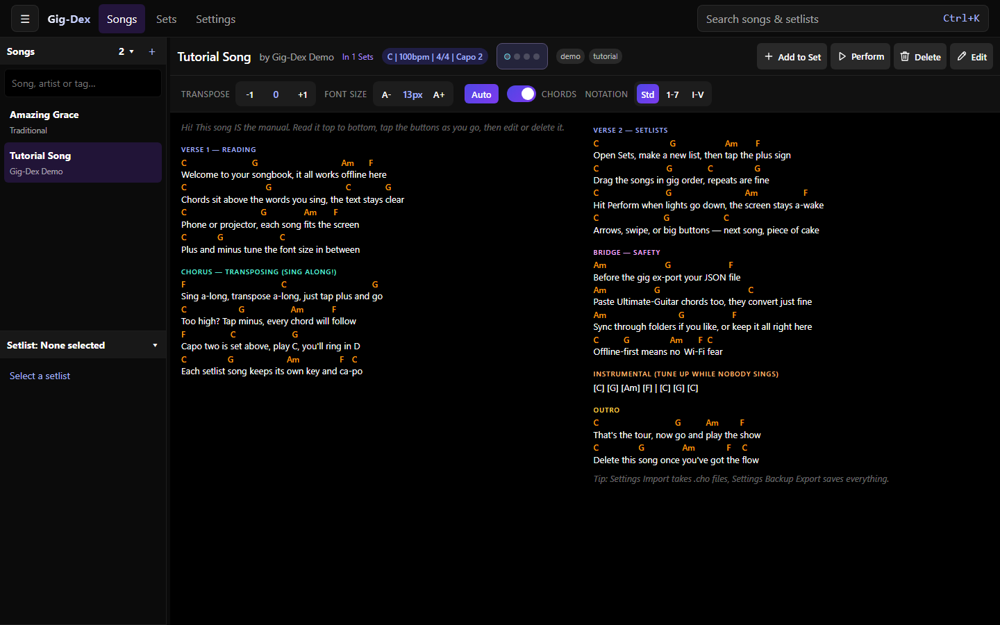
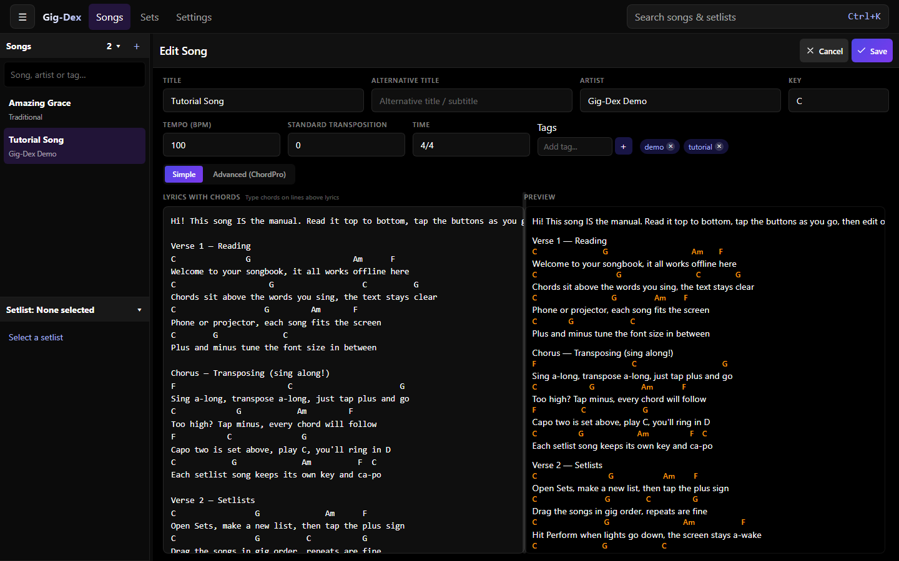
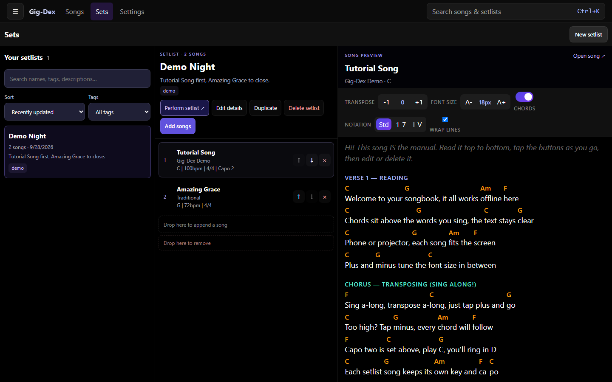

# Gig-Dex 🎸

**Your digital songbook and setlist manager for the stage, the rehearsal room, and the couch.**

Gig-Dex keeps all your songs, chords, and setlists in one place, readable on phone, tablet, or laptop, even when the venue Wi-Fi gives up.

👉 **Try it:** https://fannon.github.io/gig-dex/

> [!NOTE]
> Gig-Dex is a hobby side-project, built mostly by "vibe-coding". It works well for daily use, but expect rapid changes and the occasional rough edge.

---

## For musicians

### What can I do with it?

- **Collect your repertoire:** keep lyrics + chords together, neatly aligned.
- **Play in any key:** transpose any song instantly and add a capo without rewriting anything.
- **Build setlists:** put songs in gig order, including repeats, notes, and per-song key/capo settings.
- **Perform distraction-free:** big, auto-fitting text, page-by-page or scrolling reading, simple Previous / Next navigation, optional visual beat pulse.
- **Read your way:** choose chord names, Nashville numbers, or Roman numerals; set a minimum font size and column limit in *Settings → Appearance → Song reading*.
- **Find songs fast:** search by title, artist, tag, or setlist with `Ctrl+K` (`Cmd+K` on Mac).
- **Works offline:** once loaded, your library is on your device. No account, no subscription, no cloud required.

It understands the popular [ChordPro](https://www.chordpro.org/) format (`[Am]Hello [G]world`), so you can paste or import songs from many other tools. The simple editor also accepts the typical guitar-chords style with chord lines above the lyrics (like [Ultimate-Guitar chord sheets](https://tabs.ultimate-guitar.com/)) and converts it automatically. Editing happens in monospace so chords stay aligned. An explicit one-click import for that format is planned.

<table>
  <tr valign="top">
    <td><a href="docs/screenshots/tutorial-song.png"></a></td>
    <td><a href="docs/screenshots/edit-song.png"></a></td>
    <td><a href="docs/screenshots/demo-setlist.png"></a></td>
  </tr>
  <tr valign="middle" align="center">
    <td><em>The Tutorial Song. Tap "Add Demo Songs" to get it.</em></td>
    <td><em>Simple editor with live preview</em></td>
    <td><em>Demo Night setlist with song preview</em></td>
  </tr>
</table>

### Get started in 3 steps (no account needed)

1. **Open the app** in your browser (link above).
2. **Add songs:** go to *Settings → Library → Import ChordPro songs* and select a few `.pro` / `.chopro` / `.txt` files, or create a new song and paste text.
3. **Make a setlist:** go to *Sets → New setlist*, tap **+** on songs to add them, then hit **Perform setlist**.

Press **Save** after editing a song or setlist details. Setlist song order and additions are saved automatically on that device.

### Your songs are safe: backup & sync

Your library lives **on your device** (in your browser). That means it's private and offline-capable. You should still back it up or sync it if you use multiple devices.

**1. Backup file: simple and available to everyone**

*Settings → Library → Export library* downloads a single `.json` file with all your songs and setlists. Email it to yourself, put it on a USB stick, keep it somewhere safe. To add one on any device, select it under *Settings → Library → Restore backup*, review the file preview, leave **Restore mode** on **Merge**, then press **Import**. Selecting the file alone does not import it. **Replace library** removes the current library first; use it only with a complete backup.

Use this before gigs, before updates, before cleaning up. It just works.

**2. Dropbox sync: easiest direct option across desktop and mobile**

Dropbox works directly in the browser on desktop and mobile. You first register your own free Dropbox app, copy its public app key into *Settings → Sync → Add sync provider → Configure Dropbox*, and connect your account. Follow the [Dropbox setup guide](docs/dropbox-sync.md). No desktop sync client is needed.

Once connected, Gig-Dex checks for remote changes when it opens and syncs after you save a song or setlist or finish an import. Use **Sync now** for an immediate check if another device changed the library while this app stayed open. Dropbox needs internet access, and you may need to reconnect after closing the browser session.

**3. Local folder sync: use your existing cloud folder**

If you already use OneDrive, Google Drive, Dropbox, or Nextcloud on your computer, folder sync needs no separate app registration:

In *Settings → Sync → Sync from a folder on this computer*, pick a dedicated folder **inside** your existing sync folder (e.g. inside your OneDrive folder).

Gig-Dex checks the folder when it opens and syncs after saved edits and imports while the app is open. It writes small files to that folder, and *your existing desktop sync app* carries them to your other computers. Press **Sync now** if files arrive while Gig-Dex stays open and you want to pull them immediately. No extra login in Gig-Dex, no registration, and folder sync works offline.

Placing a backup `.json` file in the sync folder does not import it. Select it through *Settings → Library → Restore backup* and press **Import**; the connected folder then syncs automatically.

The song editor supports simple chords-over-words text and standard ChordPro. Library file import accepts ChordPro; full library import/export uses Gig-Dex JSON. The global *Settings → Appearance → Notation* choice can display standard stored chords using German spelling (`H` for B natural, `B` for B flat) without changing their pitches.

Limitations to know:

- Picking a folder only works in Chrome or Edge on desktop (browser limitation).
- On your phone/tablet, use Dropbox direct sync or a backup file because mobile browsers can't pick local sync folders.

Details: [docs/local-folder-sync.md](docs/local-folder-sync.md)

**4. Direct Google Drive / OneDrive sync: advanced setup**

Gig-Dex can also talk directly to Google Drive and OneDrive, but there is no shared, ready-to-click cloud integration:

> You have to register your **own** cloud app and paste its public Client ID into Gig-Dex under *Settings → Sync → Configure Google Drive/OneDrive*.

That's doable if you're tech-savvy, but registering OAuth apps, redirect URLs, and consent screens is fiddly. **Most musicians should use Dropbox or a local folder.**

For Google Drive or OneDrive, start with [docs/local-folder-sync.md](docs/local-folder-sync.md) ("Runtime cloud configuration").

Direct Google Drive still needs **Sync now** because its sign-in flow can open a popup; connected OneDrive sessions check automatically on open.

Under each provider's **Recent activity**, you can see how many songs and setlists were added, updated or removed, with separate **Sent** and **Received** counts. Failed syncs show any changes that completed; unchanged records are not counted.

### Install it like an app (Android / desktop)

Open the live URL in Chrome or Edge and use the browser's **Install app** or **Add to home screen** action. It then opens as an app, stays available offline after its files are downloaded, and can keep the screen awake during a gig (see *Performance options*).

Before an important gig, open your setlist once while online, then try airplane mode and close/reopen the app. You'll see exactly what the stage will see.

---

## For developers

Gig-Dex is a React + Vite + TypeScript PWA. Storage is IndexedDB (via `idb`), sync is file-based revision exchange (local folder, Google Drive, OneDrive, Dropbox).

### Quickstart

Dependencies are locked with `bun.lock`. Install with Bun; the task scripts also run with npm:

```bash
bun install --frozen-lockfile
npm run dev        # start dev server
npm run validate   # lint + typecheck + unit tests; run after every change
npm run verify     # validate + build + E2E tests; run before declaring "done"
```

More commands:

- `npm run test` / `npm run test:e2e`: Vitest / Playwright
- `npm run lint:fix` / `npm run format`: Biome
- `npm run screenshots -- --input tmp/import --output reports/song-layout`: song layout audit (see script help)
- `node scripts/readme-screenshots.mjs`: regenerate the synthetic README screenshots

### Docs

- Sync design (local folder + bring-your-own Client IDs): [docs/local-folder-sync.md](docs/local-folder-sync.md)
- Dropbox app setup: [docs/dropbox-sync.md](docs/dropbox-sync.md)
- Sync folder file format and compatibility: [docs/sync-format.md](docs/sync-format.md)
- Setlists workspace: [docs/sets-workspace.md](docs/sets-workspace.md)
- Offline / PWA / Android: [docs/pwa-offline-2026-09-27.md](docs/pwa-offline-2026-09-27.md)
- Performance mode, song defaults: [docs/song-defaults-and-performance.md](docs/song-defaults-and-performance.md), [docs/performance-and-onedrive-2026-09-27.md](docs/performance-and-onedrive-2026-09-27.md)
- Search & reading settings: [docs/search-and-reading-settings.md](docs/search-and-reading-settings.md)

OneDrive / Google OAuth setup for local development lives in those docs. End users don't need it.

---

*Made with ☕ and "vibes".*
